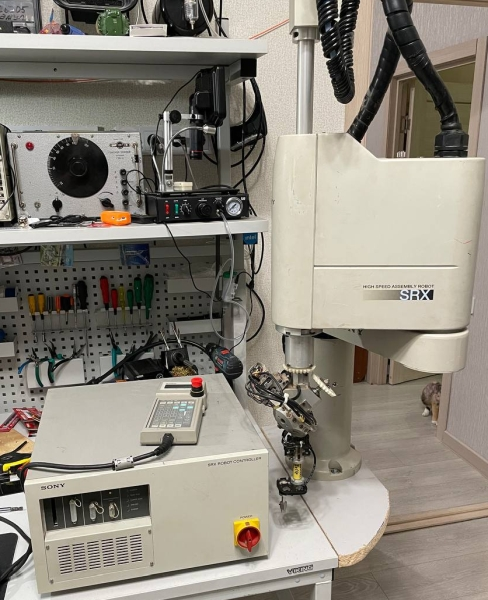

# Sony SRX-611 — Reverse Engineering

Static (IDA-based) reverse engineering of the **Sony SRX-611 SCARA robot** and its
controller/board firmware. This repository collects the extracted firmware images, the
IDA databases, component datasheets and the analysis notes.

> Agent/work context and per-address details live in [`AGENTS.md`](AGENTS.md).

---

## 1. The robot (from the SRX-611 Operation Manual)

The **SRX-611** is a member of the **Sony SRX-600 high-speed assembly robot series** — a
SCARA robot for small-parts assembly, inspection and handling. It uses brushless AC
servo motors with **absolute encoders** (battery-backed), so it is maintenance-free and
needs no home return in normal use.

- **Kinematics:** SCARA, **4 axes** (X, Y, Z, R).
- **Drive:** all-axis AC servo, **software servo** (no separate servo controller per axis).
- **Position detection:** absolute method, battery back-up.
- **Programming language:** **LUNA** (Ver. 5.0), compiled on DOS (≥ 5.0), debugged from
  Windows with the SRX Platform kit; teaching via the optional teaching pendant.
- **Controller:** **SRX-C61** — see control specifications below.
- **Multi-task:** 16 LUNA tasks (8 robot + 8 peripheral) + 1 system task + 1 PLC task
  (18 total), plus a Boolean-algebra **PLC** engine sharing the robot's I/O.
- **Safety / SMART option:** the SMART variant adds a hardware **Drive Safety Switch
  (DSS)** (`DSS0`/`DSS1` on the safety connector) and an over-speed detector (SPD panel
  board).
- **Error reporting:** numeric codes `E nnn` (`E000…E400` in the manual) shown on the
  teaching pendant; the later SMART firmware adds **`E401 DSS off error`**.

### 1.1 Unit specifications — SRX-611 (L6015)

| Item | Value |
|---|---|
| Total arm length | 600 mm (1st arm 350 mm, 2nd arm 250 mm) |
| Z axis stroke | 150 mm |
| R axis range | 360° |
| Payload | 2 kg / 3 kg / 5 kg (4.4 / 6.6 / 11 lbs.) |
| Cycle time | 0.6 s (2 kg payload) |
| Max speed | arms 5200 mm/s, Z 770 mm/s, R 1150°/s |
| Pose-repeatability | X-Y 0.01 mm, Z 0.02 mm, R 0.03° |
| Weight | 35 kg (77 lbs.) |
| Tool items | 15 signal wires, 3 air ducts |

**Model variants:** `L4015` (400 mm, arms 200/200), `L8015` (800 mm, arms 450/350),
and long-Z versions `L**45` (Z stroke 450 mm).

### 1.2 Controller specifications — SRX-C61

| Item | Value |
|---|---|
| CPU | **Intel i486DX2 (50 MHz internal)** |
| Drive / axes | AC servo, software servo; simultaneous & individual control of axes 1–4 |
| Motion | PTP, CP, overlap motion, QM, QT; 3-D linear and 3-D circular interpolation |
| Speed control | 1–100 % in 100 steps, override 1–100 % |
| Output | motor power total max 1000 W |
| Program storage | 3072 points per program, 176 kB total across all tasks |
| Memory card | PC Card (PCMCIA 2.1 Type 1) |
| Serial I/F | RS-232C × 3 (teaching pendant, programming device, general purpose) |
| Expansion | 3 slots (vision board, I/O board, …) |
| Power | single-phase AC 200–240 V ±10 %, 50/60 Hz, 1.5 kVA |
| Dimensions / weight | 430 (w) × 440 (d) × 240.5 (h) mm ≈ 5U DIN; 25 kg |
| Environment | 0–40 °C, 35–90 % RH (non-condensing) |

---

## 2. Firmware / binaries

All paths are relative to the project root.

| Firmware | Files | Device | Target CPU | Description | Research status |
|---|---|---|---|---|---|
| **CPU main firmware** | `FW\SRX6-CPU\2\ROM1-C.bin` (1 MB) | 2× **MT28F400B5** flash, U24+U25, 512 KB each | **Intel 80486** (16-bit real mode, 32-bit regs) | Controller OS (`OS+/386 V2.0`) + robot application + **LUNA** interpreter | **In progress — primary target.** IDA DB `ROM1-C.bin.i64`, 1298 annotated functions, architecture & error reports, partial C decompilation |
| **CPU boot EPROM** | `FW\SRX6-CPU\2\U23_M27C256B@DIP28.BIN`, `FW\SRX6-CPU\1\U26_….BIN`, `FW\SRX6-CPU\M27C256B@DIP28.BIN` (all identical) | **M27C256B**, 32 KB | Intel 80486 | Boot/monitor EPROM, separate from the main image | Preliminary — IDA DBs (`80486r`) exist |
| **Teach pendant (TP)** | `FW\TP\IC6_M27C256B@DIP28.BIN` (32 KB) | **M27C256B** | **Hitachi HD64180/Z180** | Thin terminal: keypad, 20-char display, serial command interpreter | **Analysed** — see [`doc\TP_firmware_structure.md`](doc/TP_firmware_structure.md) |
| **Servo board** | `FW\SRX6-SERVO\ROM_SERVO.bin` (256 KB); sources `1\U41_P28F010@DIP32.HEX`, `1\U42_P28F010@DIP32.BIN`; PLD `2\U43.GAL16V8B.JED` | 2× **P28F010**, U41+U42, 128 KB each (byte-interleaved: U41 = even bytes) | servo amplifier MCU (16-bit bus) | Servo amplifier/monitor firmware ("Servo Board Monitor ©1995 Sony") | IDA DB `ROM_SERVO.bin.i64` exists; not written up |
| **Servo-I/O board** | `FW\SERVO_IO\1\U7_M27C512@DIP28.BIN`, `FW\SERVO_IO\1\U18_M27C512@DIP28.BIN` (64 KB each) | 2× **M27C512** | 32-bit RISC (likely **NEC µPD70732 / V810**) | Servo-I/O controller pair (no ASCII strings in the dumps) | Not started |
| **PC-side tools** | `SRXWIN\SRXWIN\*.EXE` (+ `SRXWIN.zip`) | — (x86 DOS/Windows) | host PC | `LUNNA.EXE`/`LUNNAPR.EXE` (LUNA), `SRXMONIE.EXE` (monitor), `PLC.EXE`, `POINT.EXE`, `MONIT.EXE`, `RECALL.EXE`, `SEND.EXE`, … | Not started |

Component datasheets, manuals and design files (SRX operation manual, user training
manual, SPD panel board, 486DX2/DX4, M27C256B, Altera MAX 7000, NEC µPD70732/V810, …)
are listed in [`AGENTS.md`](AGENTS.md) §2.6.

---

## 3. Research status

Research **started with the CPU-board firmware** (`ROM1-C.bin`), which is the core of the
controller, and is the most advanced track. The other boards have only raw dumps and/or
preliminary IDA databases.

### 3.1 CPU firmware (`ROM1-C.bin`) — done so far

- Full disassembly/annotation in IDA Pro 9.0 (`ROM1-C.bin.i64`): **1298 functions**
  named by category, each with a call-popularity comment;
  [`function_popularity.md`](doc/function_popularity.md).
- Platform established: 80486 real mode, runtime base `0xFFE00000 + file offset`,
  `int 90h/91h` syscall ABI, `OS+/386 V2.0`.
- Subsystems mapped: kernel/OS, config validation, parameter DB, PLC engine,
  motion/point, teach-pendant UI, LUNA language, error reporting.
- **Error system analysed**: full `E000…E401` message table; identified
  **`E401 = DSS off error`** (SMART) —
  [`SRX-611_error_401_DSS_report.md`](doc/SRX-611_error_401_DSS_report.md).
- Architecture report with diagrams:
  [`SRX-611_firmware_architecture.md`](doc/SRX-611_firmware_architecture.md).
- Partial C decompilation (Hex-Rays): `FW\SRX6-CPU\2\c_decomp\` (top-50 functions) and
  `FW\SRX6-CPU\2\c_decomp_luna\` (LUNA subsystem, 43 functions +
  [`LUNA_analysis.md`](doc/LUNA_analysis.md)).

### 3.2 Planned / remaining

- Complete the CPU-firmware decompilation (several switch-heavy functions must be
  hand-reconstructed; see `AGENTS.md` §8).
- Servo board: document `ROM_SERVO.bin` (monitor console, amplifier diagnostics).
- Servo-I/O board: load `U7`/`U18` into IDA and identify the CPU.
- PC tools (`SRXWIN`): document the host protocols, file formats and LUNA toolchain.
- Cross-map the CPU↔TP↔servo↔servo-I/O communication protocols.

---

## 4. Documentation

Detailed analysis notes are collected in [`doc/`](doc):

| Document | Contents |
|---|---|
| [`SRX-611_firmware_architecture.md`](doc/SRX-611_firmware_architecture.md) | CPU-firmware architecture report (with mermaid diagrams) |
| [`SRX-611_error_401_DSS_report.md`](doc/SRX-611_error_401_DSS_report.md) | Error-reporting system + full `E000…E401` analysis; `E401 = DSS off` |
| [`TP_firmware_structure.md`](doc/TP_firmware_structure.md) | Teach-pendant (HD64180) memory map, command dispatcher, `"SRX6"`↔`"TP4"` handshake |
| [`LUNA_analysis.md`](doc/LUNA_analysis.md) | LUNA language subsystem analysis (companion to `FW\SRX6-CPU\2\c_decomp_luna\`) |
| [`function_popularity.md`](doc/function_popularity.md) | All 1298 CPU functions ranked by call popularity + comments |

The project-wide agent context and per-address reference is [`AGENTS.md`](AGENTS.md).
