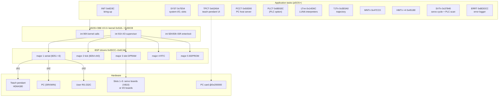
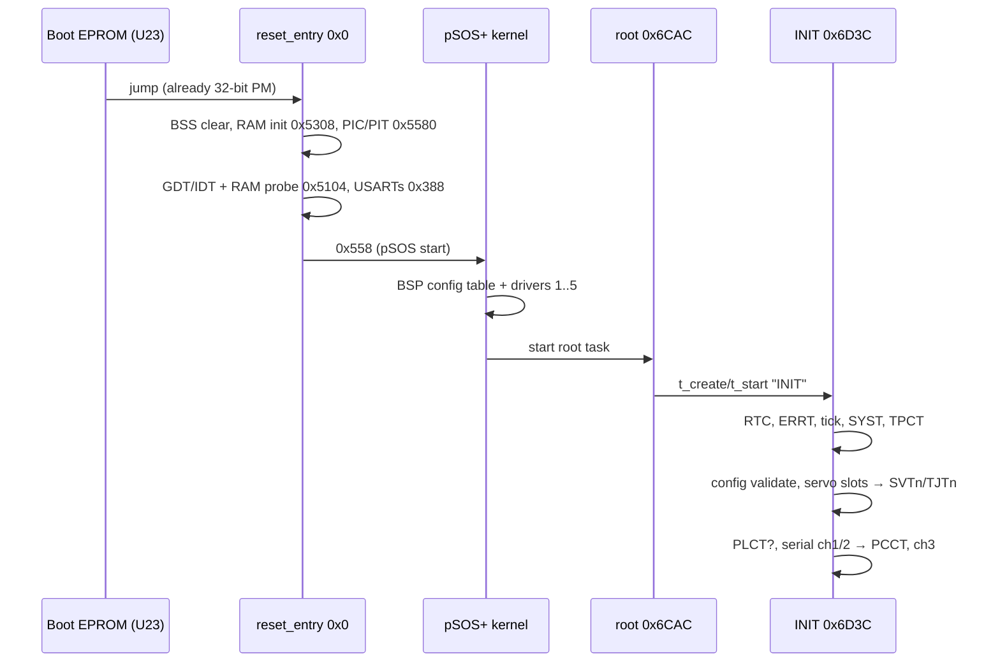
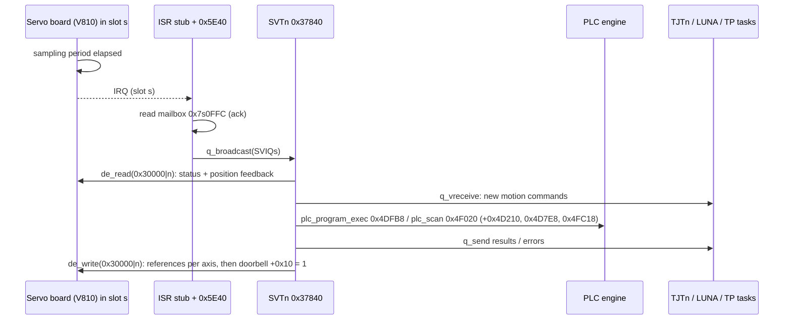

# Sony SRX-611 CPU Board Firmware — Architecture Report (v2)

**Image:** `FW/SRX6-CPU/2/ROM1-C.bin` (1 MB, linked at `0xFFE00000`) / IDA DB `ROM1-C.bin.i64`
**Target:** Sony SRX-611 SCARA robot controller, CPU board
**Method:** static analysis. v1 used IDA 9.0 + IDAPython. v2 (2026-09-26) re-checked everything
with a capstone linear sweep of the 32-bit code, a decoder for the ROM→RAM init stream
(`tools/cpu/rom1c_raminit.py`), a Z80 disassembly of the teach-pendant ROM, and the servo-board
ROM. No hardware was used.
**Addresses** are **file offsets** (runtime = `0xFFE00000 + offset`) unless marked *RAM* or
*phys*. **Confidence:** **[C]** confirmed from code, **[I]** inferred with good evidence,
**[H]** hypothesis.

---

## 1. Executive summary

`ROM1-C.bin` is the main firmware of the SRX-611 controller.
- **CPU and OS.** It runs on an i486 in **32-bit flat protected mode**
  (`0x5104` builds the GDT). The RTOS is **pSOS+/386 V2.0.I** from **Integrated Systems Inc.**
  (©1993), not a Sony OS. The v1 name "OS+/386" was the banner with its leading "p" cut off.
- **Structure.** The application is a set of pSOS+ tasks: system, teach pendant, PC link, PLC,
  per-robot servo and trajectory tasks, per-program LUNA interpreter tasks, and an error logger.
  They talk to the outside world through **pSOS+ device drivers** (`de_init/read/write/cntrl`):
  | Major | Device | Hardware |
  |---|---|---|
  | 1 | 3 serial channels | **three 8251A USARTs** clocked by an **8254** |
  | 3 | robot servo channel | **five slot windows of dual-port RAM** at phys `0x700000`–`0x74FFFF` |
  | 4 | real-time clock | RTC chip on ports `0x60–0x9C` |
  | 5 | 8 KB EEPROM | memory at phys `0x600000` |
- **The three serial channels:**
  - **ch 1** is the **teach pendant**. It uses ESC frames **without a checksum**, with the handshake
    `"SRX6"` → `"TP4"`, and the CPU uses 38 command codes. It is the "unknown peer on
    `0x10001`" of earlier notes.
  - **ch 2** is the **PC/SRXWIN host link** (`doc/SRXWIN_protocol.md`).
  - **ch 3** is the **user RS-232C port** used by the LUNA `READ/WRITE/RSSET/RSINP/RSOUT/…`
    statements.
- **Servo boards.** Each board sits in a slot with its own DPRAM window and IRQ. The firmware maps
  every robot axis to a *(slot, sub-axis)* pair, the **SLOT/AXIS** setting. The per-robot servo task
  **SVTn** runs once per servo-board interrupt: it reads feedback, runs the motion **and the PLC
  scan**, and writes references back into DPRAM. Kind-3 boards in the same slots are **I/O
  boards**; they supply the system-input image used for DSS/E401.
- **Strings.** Almost all strings and the pointer tables that index them are **copied from ROM
  into RAM at boot**, so code references RAM addresses (e.g. the E000–E401 table at RAM
  `0x26F4`). That is why string xrefs never resolved in IDA.



---

## 2. Corrections to report v1

| v1 statement | Finding (v2) | Evidence |
|---|---|---|
| "16-bit real mode + 32-bit registers", "Intel 80486 (real mode)" | **32-bit flat protected mode.** `0x5104` builds 4 GB descriptors (selector `08` code `0x9B`, `10` data `0x93`, granularity `0xD0`); `lidt/lgdt` at `0x31`; ISRs use `iretd` and load `ds=es=8`. The switch into protected mode happens in the boot EPROM. **[C]** | §3, §4 |
| RTOS "OS+/386 V2.0" (Sony) | **pSOS+/386 V2.0.I, Integrated Systems Inc. 1993**; banner `pSOS+/386 V2.0.I` @`0x5B8`, followed by `KC_*` config-table names. **[C]** | §5 |
| "~38 syscall wrappers, semantics unknown" | Wrappers `0xCDE13–0xCE556` map one-to-one onto the documented pSOS+ API (`t_create`=1 … `q_vreceive`=0x53). `int 91h` fn 1–6 = `de_init/open/close/read/write/cntrl`. **[C]** | §5.2 |
| `dma8237_init` @`0x388`, "8237A DMA ports 0xC4/0xCC/0xD4" | **No 8237.** `0x388` is `usart_init`: it writes `00 00 00 40 CE 37` to the control ports `0xC4/0xCC/0xD4` of **three 8251A USARTs**. That is the 8251 reset sequence, mode `0xCE` = async ×16, 8N2, command `0x37`. **[C]** | §6.1 |
| 8259A PICs at `0x20/0xA0` and `0xA0/0xA8` | Master PIC at **`0xA0/0xA4`**, slave at **`0xA8/0xAC`** (A0 wired to address bit 2); base vectors `0x20`/`0x28`; slave cascaded on master IRQ7. Port `0x20` is a **status/halt-code output**: `0` at reset, `0x0F` on fatal halt. **[C]** | §4.2 |
| "I/O board ports 0xC000/0xC800/0xCC00/0xD000/0xD400, port table at 0x500" | Misread. The table at `0x4FD` holds **byte ports** `{C4,C0},{CC,C8},{D4,D0}` = 8251 {status, data} per channel. `0x46C/0x4A4/0x4C9` are **polled console** status/getc/putc on the channel in `[0x888]`. **[C]** | §6.1 |
| `isr_trap3` @`0x447C`, `isr_dispatch` @`0x468C` | `0x447C` = **serial RX interrupt** (channel n = 1..3, ring buffer, wakes the reader with `sm_v`); `0x468C` = **serial TX interrupt**. **[C]** | §4.3 |
| `task_create` @`0x36DE0`, `task_scheduler` @`0x361F0` | Neither. Both are **x87-heavy maths** (`0x361F0`: 644 FPU instructions, trig; one caller `0x33510`; `0x36DE0`: 233 FPU instructions). Probably kinematics/trajectory **[I]**. Task creation is pSOS `t_create`; scheduling is inside the kernel. | §7 |
| `db_access` @`0xBB5EC` "variable DB accessor", `db_get_*/db_var_get` | **Teach-pendant request/response** on serial ch 1 (`0x10001`). The ~37 `db_*` wrappers `0xBA35C–0xBB4F4` are **TP command builders**; `db_var_get` `0xBAEDC` = TP command `60` (display text, 1 487 call sites). **[C]** | §8.1 |
| `motion_param_process` @`0x65C44` | **TP menu/screen handler.** Its only caller is TPCT, and it issues TP `60` ×104 and TP `11` (keys) ×7. **[C]** | §8.1 |
| `tp_menu_dispatch` @`0x12D84` | Reached from host "delete program" (`host_cmd_06` → `0x12A0C` → `0x12BBC` → `0x12AEC` …). It is **program-store / task management** code, not TP UI. **[I]** | — |
| `robot_task_main` @`0x1535C` = "main application task" | It is the **per-program LUNA interpreter loop**, called from the LTnn task entry `0x14D6C`; it calls `luna_exec_stmt` `0x23790` (token → handler table `0x237D8`). **[C]** | §9.1 |
| `os_syscall_90h_27h` = "error/event task" call | fn `0x27` is plain **`q_send`**. `sys_req_27h` `0xBE214` builds a 4-word error message and `q_send`s it to the ERRT task's queue. **[C]** | §9.2 |
| "Error table has no pointer/xref table" | In ROM, true. At runtime a **RAM pointer table at `0x26F4`** holds `{JP*, EN*}` per code (`code*8 + lang*4`), read at `0x6DE0C` and `0x824E9`. **[C]** | §9.2 |
| "SERVO CPU reachable via shared memory" (guess) | Confirmed and located: 5 DPRAM slot windows `0x700000 + (slot−1)·0x10000`, mailbox at `+0xFFC`, one IRQ per slot. **[C]** | §8.4 |
| Boot flow `reset → … → task_create → task_scheduler → robot_task_main` | See §3 for the actual flow. | §3 |
| Memory map (§6 of v1) | Replaced by §10 (image layout) and §4.1 (physical map). | — |

The v1 statements about the LUNA error strings, the PLC function names (`plc_scan`,
`plc_program_exec`), config validation and PC-card file operations still hold. So do the
annotation conventions.

---

## 3. Boot sequence

The boot EPROM (U23, 32 KB) enters `ROM1-C.bin` at `reset_entry` (`0x0`) already in 32-bit
protected mode.

| Step | Address | What happens | Conf. |
|---|---|---|---|
| 1 | `0x0` | `out 0x20,0` (status port); zero BSS `0x461C..0x75F7` | C |
| 2 | `0x5308` | **RAM data init**: walk the record stream at `0xCE695..0xD9D94` (296 records), copying strings, tables and variables into RAM `0x0..0xF221` (§9.3) | C |
| 3 | `0x5580` → `0x5590` | Write `0,1,2,3,4` to ports `0x30/0x34/0x38/0x3C/0x40` (5 per-slot latches, purpose unknown **[H]**); program both **8259A PICs** (ICW1 `0x19` edge/cascade/ICW4, bases `0x20`/`0x28`, slave on IR7, all masked, OCW3 = read ISR) | C |
| 4 | `0x55E0` | Program the **8254 PIT** (ports `0xB0/B4/B8`, control `0xBC`): ctr0 mode 0, `0x7A12` (system tick, re-armed in the ISR); ctr1 mode 3, `0x0A`; ctr2 mode 3, `0x14` (baud clocks, §6.1) | C |
| 5 | `0x5104` | Build GDT (flat 4 GB code/data), load GDTR/IDTR (`0x31`); point all 256 IDT gates at the halt stub `0x2A` (`cli; out 0x20,0Fh; jmp $`); RAM probe `0x50DC(0x40000..0x80000)` | C |
| 6 | `0x388` | `usart_init`: reset + mode `0xCE` + command `0x37` on all three 8251s (ch 3 uses mode `0x4E`, 1 stop bit, if `[0x880]==1`; it is always 0 in this build) | C |
| 7 | `0x62(0x518,0x40)` | Jump through the pSOS+ entry vector `0x558` → kernel start `0x2D64` | C |
| 8 | `0x63AC`… | BSP: install `int 90h/91h/92h/93h/97h` gates (`0x55E/0x564/0x56A/0x570/0x5C`), fill the pSOS+ **configuration table** (§5.1), register the **I/O drivers** (§5.3) | C |
| 9 | `0x6CAC` | **Root task** (`KC_ROOTSADR`) → `t_create("INIT", 0x69)` → `INIT` `0x6D3C` | C |
| 10 | `0x6D3C` | **INIT**: `de_init` RTC (`0x40000`); `0xC87FC` (PC card, **[I]**); create **ERRT** (`0xBDCE4`); `de_init` tick (`0x20000`); start **SYST**, **TPCT**; config load/validate (`0x300F0` → `sys_config_validate`); **servo bring-up `0x74A4`** (slots, SVT/TJT per robot); `0x11BAC`, `0x10264`; **PLCT** if the PLC check at `0xE1F4` passes; `de_init` serial ch 1 + ch 2; **PCCT**; `de_init` ch 3 at 9600 unless `[0x880]`; probe and configure the **optional 4-channel serial board** (§8.5) | C |



---

## 4. Platform

### 4.1 Physical address map (as used by the code)

| Phys. range | Contents | Conf. |
|---|---|---|
| `0x00000000`–`0x0000F221` | RAM: BSS, pSOS data, **RAM-initialised strings/tables** (§9.3) | C |
| `0x0000xxxx`–`0x001FFFFF` | RAM (pSOS region 0 ≤ 2 MB, `KC_RN0LEN` clamped to `0x200000` at `0x6495`) | I |
| `0x00200000`–… | **PC-card memory window** (common/attribute memory selected by port `0x4C`) | I |
| `0x00600000`–`0x00601FFF` | **8 KB EEPROM** (pSOS driver major 5) | C |
| `0x00700000 + (s−1)·0x10000`, s = 1..5 | **Slot s dual-port RAM window** (4 KB used; mailbox word at `+0xFFC`) | C |
| `0x02000000`–… | **Optional 4-channel serial board** (status register `0x2000010`) | I |
| `0xFFE00000`–`0xFFFFFFFF` | This flash image (`ROM1-C.bin`) | C |

### 4.2 I/O port map

| Port(s) | Device | Use | Conf. |
|---|---|---|---|
| `0x0C` | EEPROM | write-complete status (polled by `0x6A24` driver) | I |
| `0x20` | status / diagnostic output | `0` at reset, `0x0F` = fatal halt code | C |
| `0x30 0x34 0x38 0x3C 0x40` | per-slot latches | written `0..4` at init **[H: slot ID/IRQ routing]** | C (write) |
| `0x4C` | PC card | bit 0 = attribute-memory select (REG#) | I |
| `0x60`–`0x9C` (stride 4) | **RTC** (16 BCD registers) | pSOS driver major 4 (`0x672C`) | C |
| `0xA0 / 0xA4` | 8259A **master** (cmd / data) | vectors `0x20–0x27` | C |
| `0xA8 / 0xAC` | 8259A **slave** (cmd / data) | vectors `0x28–0x2F`, on master IR7 | C |
| `0xB0 0xB4 0xB8 / 0xBC` | **8254** ctr0/1/2 / control | tick; baud clocks | C |
| `0xC0 / 0xC4` | 8251A #1 data / ctrl-status | serial ch 1 = **teach pendant** | C |
| `0xC8 / 0xCC` | 8251A #2 data / ctrl-status | serial ch 2 = **PC host link** | C |
| `0xD0 / 0xD4` | 8251A #3 data / ctrl-status | serial ch 3 = **user RS-232C** | C |

### 4.3 Interrupt map

Every hardware ISR stub (`0x6D–0x387`) has the same shape: `int 92h` (pSOS `i_enter`) →
`pushad`/segment save → handler → specific EOI → `int 93h` (`i_return`) → `iretd`. The vector
table at `0x6340` (serial), `0x5E94` (slots, `{vector, stub, PIC mask}` × 5) and the calls in
`0x5ED0`/`0x6098` install them.

| Vector | PIC line | Stub | Handler | Device | Conf. |
|---|---|---|---|---|---|
| `0x21` | master IR1 | `0x6D` | `0x447C(1)` | USART ch 1 RX (TP) | C |
| `0x22` | master IR2 | `0x9B` | `0x447C(2)` | USART ch 2 RX (PC) | C |
| `0x23` | master IR3 | `0xC9` | `0x447C(3)` | USART ch 3 RX (user RS) | C |
| `0x24` | master IR4 | `0x260` | read `[0x700FFC]`; `0x5E40(1)` | **slot 1 DPRAM** | C |
| `0x25` | master IR5 | `0x296` | read `[0x710FFC]`; `0x5E40(2)` | **slot 2 DPRAM** | C |
| `0x26` | master IR6 | `0x2CC` | read `[0x720FFC]`; `0x5E40(3)` | **slot 3 DPRAM** | C |
| `0x28` | slave IR0 | `0x302` | read `[0x730FFC]`; `0x5E40(4)` | **slot 4 DPRAM** | C |
| `0x29` | slave IR1 | `0x345` | read `[0x740FFC]`; `0x5E40(5)` | **slot 5 DPRAM** | C |
| `0x2A` | slave IR2 | `0x222` | re-arm 8254 ctr0 (`0x7A12`); `0x5F18` → `tm_tick` | **system tick** (`KC_TICKS2SEC` = 100) | C |
| `0x2B` | slave IR3 | `0xF7` | `0x468C(1)` | USART ch 1 TX | C |
| `0x2C` | slave IR4 | `0x132` | `0x468C(2)` | USART ch 2 TX | C |
| `0x2D` | slave IR5 | `0x174` | `0x468C(3)` | USART ch 3 TX | C |
| `0x2E` | slave IR6 | `0x1B6` | `0x5034` → `0x47CC(1..4)` | optional 4-ch serial (§8.5) | I |
| `0x2F` | slave IR7 | `0x1E7` | `0x506C` → `0x470C(1..4)` | optional 4-ch serial | I |
| `0x90 / 0x91` | — | `0x55E / 0x564` | pSOS+ kernel / I/O supervisor | software | C |
| `0x92 / 0x93` | — | `0x56A / 0x570` | pSOS+ `i_enter` / `i_return` | software | C |
| `0x97` | — | `0x5C` | returns `0x467C` (BSP data pointer) | software | C |
| others | — | `0x2A` | halt: `cli; out 0x20,0Fh; jmp $` | unexpected | C |

`0x5E40(slot)` looks up the robot whose *pacing slot* is `slot` (table `0x46A8`) and calls
**`q_broadcast`** on that robot's `SVIQn` queue, which wakes its servo task (§8.4).

---

## 5. pSOS+/386 kernel and BSP

### 5.1 Configuration table (RAM `0x46D8`, filled at `0x64E2`–`0x655A`)

| Field | Value | Field | Value |
|---|---|---|---|
| `kc_rn0sadr / rn0len` | end of BSS / ≤ `0x200000` | `kc_ticks2sec` | **100** |
| `kc_rn0usize` | `0x40` | `kc_tslice` | 1 |
| `kc_ntask` | **60** | `kc_nio` | **11** (majors 0..10) |
| `kc_nqueue` | **50** | `kc_iojtable` | RAM `0x4758` (32-byte entries) |
| `kc_nsema4` | **75** | `kc_sysstk / intstk` | `0x1000 / 0x1000` |
| `kc_nmsgbuf` | 100 | `kc_rootsadr` | `0xFFE06CAC` |
| `kc_ntimer` | 40 | `kc_rootstk / rootmode` | `0x1000 / 0x200` |
| `kc_nlocobj` | 195 | start/delete/switch callouts, `kc_fatal` | 0 |

### 5.2 System calls (`int 90h`, function code in `EAX`)

Each wrapper at `0xCDE13–0xCE497` loads the arguments into `EBX/ECX/EDX/ESI/EDI`, executes
`int 90h`, and stores the output registers. The names follow from the argument count, the
4-character-name packing, and the call sites. **[C]** for the ones used below, **[I]** for the rest.

| Fn | Wrapper | pSOS+ call | Fn | Wrapper | pSOS+ call |
|---|---|---|---|---|---|
| `01` | `CDE13` | `t_create(name,prio,sstk,ustk,flags,&tid)` | `24` | `CE0AD` | `q_create(name,count,flags,&qid)` |
| `02` | `CDE49` | `t_ident` | `25` | `CE0DF` | `q_ident` |
| `03` | `CDE76` | `t_start(tid,mode,entry,args)` | `26` | `CE10C` | `q_delete` |
| `04` | `CDE94` | `t_restart` | `27` | `CE11D` | **`q_send(qid,msg[4])`** |
| `05` | `CDEAA` | `t_delete` | `28` | `CE140` | `q_urgent` |
| `06` | `CDEBB` | `t_suspend` | `29` | `CE163` | `q_broadcast(qid,msg,&count)` |
| `07` | `CDECC` | `t_resume` | `2A` | `CE18B` | `q_receive(qid,flags,timeout,msg)` |
| `08` | `CDEDD` | `t_setpri` | `2C` | `CE2A3` | `ev_send(tid,events)` |
| `09` | `CDEF6` | `t_mode` | `2D` | `CE2BB` | `ev_receive(ev,flags,timeout,&ev)` |
| `0A/0B` | `CDF26/CDF0F` | `t_getreg/t_setreg` | `2F/30` | `CE377/CE38B` | `as_catch/as_send` [I] |
| `0E` | `CDF4B` | `rn_create` | `33`–`37` | `CE2DB`… | `sm_create/ident/delete/`**`sm_p`** (`36`)/**`sm_v`** (`37`) |
| `0F`–`12` | `CDF8A`… | `rn_ident/delete/`**`rn_getseg`**`/rn_retseg` | `39` | `CE39F` | `tm_tick` (tick ISR) |
| `14`–`18` | `CE000`… | `pt_create/ident/delete/getbuf/retbuf` | `3A/3B` | `CE3A7/CE3BE` | `tm_set/tm_get` |
| `4D`–`53` | `CE1B4`… | `q_vcreate/vident/vdelete/vsend/vurgent/vbroadcast/vreceive` | `3C` | `CE3DD` | **`tm_wkafter(ticks)`** |
|  |  |  | `3D`–`41` | `CE3EC`… | `tm_wkwhen/evafter/evwhen/cancel/evevery` |

Helpers: `0xCDE08`/`0xCDE0C` = save flags + `cli` / restore; `0xCE55C` = `strcpy`;
`0xCE556` = `int 97h`.

### 5.3 I/O supervisor (`int 91h`) and drivers

`int 91h` fn `1..6` = `de_init/de_open/de_close/de_read/de_write/de_cntrl(dev, iopb, &ret[, &data])`
(wrappers `0xCE4AD/4CF/4EA/505/520/53B`). A device number is `major<<16 | minor`. Drivers are
registered at `0x65FC` through `0x657C(major, init, open, close, read, write, cntrl, …)`:

| Major | init | read | write | cntrl | Device | Minor numbers used |
|---|---|---|---|---|---|---|
| 1 | `0x3DCC` | `0x42B4` | `0x450C` | `0x4084` | **serial** (8251 ×3) | 1 = TP, 2 = PC, 3 = user RS-232C |
| 2 | `0x5ED0` | — | — | — | **system tick** (8254 ctr0, vector `0x2A`) | 0 |
| 3 | `0x5608` | `0x5928` | `0x5A70` | `0x5810` | **robot servo channel** (slot DPRAM) | 1..n = robot number |
| 4 | `0x672C` | `0x688C` | `0x695C` | — | **RTC** (ports `0x60–0x9C`) | 0 |
| 5 | `0x6A24` | `0x6A7C` | `0x6B1C` | — | **EEPROM** 8 KB @ phys `0x600000` | 0 |

The serial driver's per-channel control block is at `[0x461C + ch*4]`: RX ring at `+0x1C`,
TX ring at `+0x130`, semaphores at `+0x10`/`+0x14`/`+0x18`, timeouts at `+0x250`/`+0x254`.
`de_cntrl` on ch 3 can change the baud rate (8254 ctr1: `0x28` = 4800, `0x14` = 9600, `0x0A` = 19200)
and the 8251 mode byte.

---

## 6. Serial hardware

### 6.1 Three 8251A USARTs

| Ch | Data / ctrl | IRQ RX / TX | Baud clock | Line setting | Peer |
|---|---|---|---|---|---|
| 1 | `0xC0 / 0xC4` | M-IR1 / S-IR3 | 8254 ctr2, ÷20 **[I]** | mode `0xCE` = 8N2 ×16 | **Teach pendant** |
| 2 | `0xC8 / 0xCC` | M-IR2 / S-IR4 | 8254 ctr2, ÷20 **[I]** | 8N2 (SRXWIN: 9600 8N2 ✓) | **PC / SRXWIN** |
| 3 | `0xD0 / 0xD4` | M-IR3 / S-IR5 | 8254 **ctr1** (runtime selectable) **[C]** | 8N2 (8N1 if `[0x880]`), 9600 at INIT | **User RS-232C** (LUNA) |

- A ÷20 divisor for 9600 baud at ×16 implies a **3.072 MHz** 8254 input. The tick is then
  `31250 / 3.072 MHz ≈ 10.2 ms`, which matches `kc_ticks2sec = 100`. **[I]**
- The 8251 status bits the driver checks: bit 0 TxRDY, bit 1 RxRDY, bit 3/4/5 PE/OE/FE (cntrl
  returns 6 or 8 on OE/FE), bit 6 SYNDET/BRK.

---

## 7. Task model

The table lists every `t_create`/`t_start` in the image. Names are 4-character pSOS+ names from
RAM; `n` is replaced by a digit at runtime.

| Name | Entry | Prio | Created by | Role | Conf. |
|---|---|---|---|---|---|
| `INIT` | `0x6D3C` | `0x69` | root `0x6CAC` | bring-up (§3) | C |
| `SYST` | `0x7E54` | `0xDC` | INIT | system task: slot/I-O scan (`0x108FC`, `0x10AD4`), system inputs (`0x10C5C`), highest priority | C/I |
| `TPCT` | `0x62A54` | `0x78` | INIT | **teach-pendant control**: open ch 1, handshake, menus (`0x65C44` …) | C |
| `PLCT` | `0xBE63C` | `0x6E` | INIT (if the PLC option check passes) | PLC-related service task; the PLC *scan* runs in SVTn | I |
| `PCCT` | `0x50D00` | `0x73` | INIT | **PC host-protocol server** on ch 2 | C |
| `SVTn` | `0x37840` | `0xB4` | servo bring-up `0x74A4` | **servo cycle** of robot n (§8.4) | C |
| `TJTn` | `0x3E0A0` | `0xAA` | `0x74A4` | trajectory generation of robot n; creates `MNTn` | I |
| `MNTn` | `0x47CC0` | `0x8C` | `0x3E0A0` | motion sub-task (kinematics `0x497D8` → `0x33510` → `0x361F0`) | H |
| `HMTn` | `0x45180` | `0x8C` | `0x47308/0x47528/0x47928/0x47AC0` | four instances of one task: per-axis homing/origin **[H]** | H |
| `LTnn` | `0x14D6C` | variable | `0x189EC`, `0x1900C` | **LUNA program task** (one per running program) → `robot_task_main` `0x1535C` | C |
| `ERRT` | `0xBDDCC` | `0xC8` | INIT (`0xBDCE4`) | **error logger**: receives `q_send` from `sys_req_27h`, keeps history, notifies the TP | C |

The RAM name pool at `0x7640` also holds the queue/region names `SVIQ`, `SVQn`, `TJQn`, `TJSn`, `SPQn`,
`HMQn`, `ERRQ`, `ERSM`, `EEPR`, `SRGN/SPRG`, `LRGN/LPnn`, `PRGN/PPnn`.

---

## 8. External interfaces

### 8.1 Teach pendant — serial ch 1 (`0x10001`)

**Link layer** (`0xBB5EC`, CPU = client, TP = server):
1. `de_cntrl` (flush);
2. write the request `1B LEN CMD args…` (LEN = total length, **no checksum**);
3. read 1 byte, which must be `1B` (otherwise `0xA12`), then LEN, then LEN−2 more bytes.

Error returns: `0xA11` write incomplete, `0xA12` bad lead byte, `0xA16` driver error (also returned
immediately when the flag function `0x8884` returns 1, **[H]** TP disconnected), `5` timeout, `0x3E9` string > 250 characters. Reply byte 3 is the TP
status; a non-zero status *s* is returned as **`20000 + s`** (`add ax,4E20h`). The TP side is
`sub_25C` @`0x025C` in `FW/TP/IC6_…BIN` (`doc/TP_firmware_structure.md`).

**Session start** (TPCT `0x62A54`): `0xBB57C` sets two channel parameters (`de_cntrl` 2/3 =
`0x32`) → `tm_wkafter` → `0xBA35C`: `1B 07 01 'S' 'R' 'X' '6'` → expect `… 00 'T' 'P' '4'`. RAM
`0x1270` holds `"SRX6"`.

**Command set.** The CPU builders are the old `db_*` functions; the TP handlers were located by
decoding the TP dispatcher. The TP also accepts `70–72`, `78`, `B0–B4` and `C0–CA`, but those are
1-byte `ret` stubs and the CPU never sends them.

| Cmd | Len | CPU builder | Call sites | TP handler | Observed effect | Conf. |
|---|---|---|---|---|---|---|
| `01` | 7 | `0xBA35C` | 1 | `0x12ED` | handshake `SRX6` → `TP4` (status 8 = MISMATCH) | C |
| `10` | 3 | `0xBA3C4` | 0 | `0x1346` | read **new key presses** (edge-detected, codes via table `0x1259`) + 2 switch bits of `[0x8015]` | C |
| `11` | 3 | `0xBA464` | 11 | `0x1350` | read **held keys** (with auto-repeat), same reply format | C |
| `20`–`23` | 5/4 | `0xBA504`–`0xBA614` | 3 each | `0x1553`–`0x15D1` | set TP mode variables (`0x839C–0x839F`, `0x8074` = key-repeat control) | I |
| `30`–`34` | 5/4 | `0xBA66C`–`0xBA7D4` | 85/34/34/32/20 | `0x15EC`–`0x17C0` | **cursor / line positioning** (update `0x8393/94/98/99`, redraw) | I |
| `40`–`43` | 3/var | `0xBA82C`–`0xBAA4C` | 0/21/35/0 | `0x1821`–`0x18FA` | display-area operations (`0x194B/1961/197B`) | H |
| `50 53 55` | var/4 | `0xBAB2C 0xBAC0C 0xBAD04` | 0 | `0x19BF 0x1A0D 0x1A5F` | text/field output variants | H |
| `5A`–`5D` | 3 | `0xBAD5C`–`0xBAE7C` | 0 | `0x1AB6`–`0x1B4F` | field/edit operations | H |
| **`60`** | var | **`0xBAEDC`** | **1 487** | `0x1BBC` | **write text string** at the cursor (header 5 bytes: 2 params + text ≤ 250) | C |
| `63 65` | var/6 | `0xBAFD4 0xBB0DC` | 0 | `0x1C18 0x1C78` | text variants | H |
| `79` | 7 | `0xBB13C` | 55 | `0x1D0C` | define window/field: 4 range-checked params (status 11 on error) | I |
| `7A` | 4 | `0xBB1A4` | 5 | `0x1D9B` | window/field select | H |
| `80 81` | 4 | `0xBB1FC 0xBB254` | 0 | `0x1DE8 0x1E4E` | — | — |
| `8F` | 3 | `0xBB2AC` | 14 | `0x1ECF` | — | — |
| `90` | 4 | `0xBB30C` | 57 | `0x1ED6` | set TP variable `0x839A` | I |
| `91` | 5 | `0xBB364` | 20 | `0x1F1B` | 2-param setting | H |
| `92` | 5 | `0xBB3C4` | 378 | `0x1F75` | `(state ∈ {0,1,2,FE,FF}, n < 6)` → indicator control, probably **LEDs/buzzer** | H |
| `93` | 11 | `0xBB424` | 6 | `0x1FB6` | **define LCD custom character** n (< 8): HD44780 `0x40 | n<<3` + 7 rows | C |
| `A0` | 3 | `0xBB494` | 4 | `0x1FFE` | query → `1B 06 A0 st [8399] [8398]` (cursor position) | C |
| `A1` | 3 | `0xBB4F4` | 0 | `0x2028` | query → `1B 05 A1 st [839B]` | C |

### 8.2 PC / SRXWIN host link — serial ch 2 (`0x10002`)

Server task **PCCT** `0x50D00`. It reads a frame (`1B LEN CMD … SUM`), dispatches through the
172-entry `host_cmd_table` `0x51828`, and replies with status → `E(4000+s)` on the PC. The full
description is in [`SRXWIN_protocol.md`](SRXWIN_protocol.md) §9. Hardware: 8251 #2, 8N2, 9600.
Unlike the TP link, this link **has** a checksum and a 3-retry reader (`0x51088`).

### 8.3 User RS-232C port — serial ch 3 (`0x10003`)

Opened by INIT at **9600 baud** (`de_cntrl` code 1 = `0x2580`). The ≈38 accesses are all inside
the LUNA I/O statement handlers, which are reached through the **LUNA executor table `0x237D8`**
(§9.1):

| LUNA token | Statement | Handler | Uses |
|---|---|---|---|
| `B7` | `READ`/`READ2` | `0x2B388` | `de_read` ch 3 |
| `B8` | `WRITE`/`WRITE2` | `0x2B5E0` | `de_write` ch 3 |
| `B9` | `RSSET` | `0x2B9D0` | `de_cntrl` ch 3 (line setup) |
| `BA` | `RSINP` | `0x2BA80` | `de_read` ch 3 |
| `BB` | `RSOUT` | `0x2BB30` | `de_write` ch 3 |
| `C0` | `RSSPEED` | `0x2BF70` | `de_cntrl` ch 3 (8254 ctr1: 4800/9600/19200) |
| `C1` | `RSCLR` | `0x2C040` | `de_cntrl` ch 3 (flush) |

`RSSTAT`/`RSSTAT2` (status variables `0A/05`, `0A/06`) and further helpers (`0x2C0D0`–`0x2D150`,
`0x1AA4C`, `0x24168`) also use ch 3. Everything is skipped if `[0x880] ≠ 0`.

### 8.4 Slot bus, servo boards and the servo cycle

**Slots.** The controller has **5 slots**. Slot *s* has its own **dual-port RAM window** at phys
`0x700000 + (s−1)·0x10000`, its own IRQ (§4.3) and an interrupt-acknowledge **mailbox** word at
`+0xFFC`, which the ISR reads. The board in a slot describes itself in its window header:

| Offset | Size | Meaning | Conf. |
|---|---|---|---|
| `+0x00` | byte | board info (servo: type/axis info; I/O: `lo nibble` = input groups, `hi nibble` = output groups, ×8 points) | C |
| `+0x01` | byte | **board kind / ready**: `1` = servo board, `3` = I/O board | C |
| `+0x04` | word | handshake: the CPU writes `0xFFFF` and re-writes up to 5× until it reads back | C |
| `+0x10` | dword | **command-pending doorbell**: the CPU sets 1 after writing all axes of the slot; must be 0 before the next read/write (else error) | C |
| `+0x14` | dword | per-axis bit field set/cleared by the CPU each cycle (**[H]** servo-ON request bits) | C (use) |
| `+0x18` | dword | **axis-enable mask**: bit *k* = sub-axis *k* in use | C |
| `+0x1C` | dword | value read back per cycle (**[H]** cycle counter/status) | C (use) |
| `+0x20` | dword | parameter written at open | C (use) |
| `+0x100·(k+1)` | block | **per-axis block** for sub-axis *k* = 0..3 | C |
| `+0xF00` | 8 bytes | servo-board **ROM version string** (`0x897C` reads it from slot 1 for the "SRV ROM" screen) | C |
| `+0xFFC` | word | IRQ mailbox (read = acknowledge) | C |

**Discovery** (`0x74A4`, called by INIT):
1. Poll the five windows twice, 50 ticks apart; a slot with kind 1 is a servo board.
2. Create `SVIQ<s>` (`q_create`) for every present slot.
3. For each configured robot, read its axis → slot map (`0xB8E4`, the **SLOT/AXIS** setting),
   check it, and create `SVQn`/`SVTn` and `TJQn`/`TJTn`. Errors: slot 0 or > 5 → `0x85`; slot
   without a board → `0x0A`.
4. `de_init(0x30000|robot)` then builds the robot block (`[0x46A4+robot*4]`):
   - axis count;
   - per axis: slot (`+0x30`), sub-axis (`+0x1C`, 0..3, which allows up to 4 axes per board),
     direction ±1 (`+0x0C`, the **CNTR DIR** setting), origin offset (`+0x20`);
   - pointers to the slot header (`+0x38`) and the per-axis block (`+0x48`);
   - a check that the kind byte is 1, and the axis bits in `+0x18`.
5. `de_cntrl` installs and unmasks the slot IRQ, performs the `+0x04` handshake, and sets the
   doorbell.

**Per-axis block** (sub-axis *k*, `slot_base + 0x100·(k+1)`), as accessed by the driver:

| Direction | Offsets | Content (scaling by the driver) | Conf. |
|---|---|---|---|
| CPU → board (`de_write` `0x5A70`) | `+0x00` | command word (`0x10` has special handling) | C |
|  | `+0x04` | **position reference** = (target − origin) × dir, integer | C |
|  | `+0x08 +0x0C +0x10 +0x40` | float references × dir (**[H]** velocity / accel / torque feed-forward) | C (layout) |
|  | `+0x14 +0x18 +0x20 +0x24 +0x2C +0x3C +0x44…` | integer parameters / limits | C (layout) |
|  | `+0x54…+0x5F`, `+0x60…+0x6B` | 12 signed bytes × dir, 12 flag bytes | C (layout) |
| board → CPU (`de_read` `0x5928`) | `+0x00` | axis status word | C |
|  | `+0x30` | **position feedback** → × dir + origin | C |
|  | `+0x14 +0x20 +0x34 +0x38` | further feedback values | C (layout) |

**Servo cycle.** Each robot is *paced* by the IRQ of one designated slot (robot block `+0`):



So the PLC scan time is tied to the servo sampling period, and a servo board that stops
interrupting also stops the PLC. The CPU-side error texts for this path are `SERVO CPU
communication error`, `SVO WATCHDOG ERR`, `SLOT ACCESS ERR` and `Servo board is disconnected`.

**Hardware context.** The owner reports **four physically separate servo controllers**. That fits
this design: one servo board per axis in slots 1–4, each with its own DPRAM and IRQ, with a
SLOT/AXIS map of `axis n → slot n, sub-axis 0`. Slot 5 is then free for a fifth board or an I/O
board. The firmware itself would also accept up to 4 axes on one board.

The servo board firmware (`FW/SRX6-SERVO/ROM_SERVO.bin`) runs on an **NEC V810 (µPD70732)**:
- its reset vector at `0x3FFF0` is `movhi 0x10,r0,r31; jmp [r31]`, and its interrupt slots hold
  V810 `jr` instructions;
- it knows axes 1–4 (`AMP ERROR(axis 1/2)`, `(axis 3/4)`), has a `MODE (L/R)` local/remote switch
  and `RMTCMD`;
- it reports `host CPU communication error` and `host CPU watch dog timer error`, which is the
  board-side view of this DPRAM link.

The exact slot population of the owner's unit cannot be read from the firmware; see §12.

**I/O boards (kind 3).** `0x108FC` (SYST) scans the same windows for kind 3:
- It adds `lo nibble × 8` inputs and `hi nibble × 8` outputs, each capped at 512 (`0x6230`,
  `0x6380`).
- It maps every 16-bit input word at `slot_base + 4…` into the pointer table `0x6238[]` and the
  image `0x62B8[]`. That is the **system-input image** in which bit 6 of word 0 is the **DSS**
  input (E401, `doc/SRX-611_error_401_DSS_report.md`).
- It maps the output words into `0x6388[]`, with shadow copies at `0x6408/0x6448/0x6488`.

### 8.5 Other devices

| Device | Access | Code | Conf. |
|---|---|---|---|
| **RTC** | ports `0x60–0x9C`, 16 BCD registers (control writes to `0x74/0x78/0x7C`, **[I]** hold/stop) | driver major 4 `0x672C–0x6A1F`; used by config/clock (`0x2FFB8`, `0x2FFF8`, `0x30078`) | C |
| **EEPROM 8 KB** | memory `0x600000–0x601FFF`, write-busy on port `0x0C` | driver major 5 `0x6A24–0x6CAB`; parameter read/write `0x8A2C`, `0x8B74` | C/I |
| **PC card** (PCMCIA SRAM card, FAT12) | window at phys `0x200000`, port `0x4C` bit 0 = attribute memory (CIS read at even addresses) | `0xC87D4`, `0xC898C`, `0xC8B24`…; file ops `pccard_file_op` `0xCA6FC` | I |
| **Optional 4-channel serial board** | memory `0x2000000` (status `0x2000010`), IRQ slave 6/7 | detected by `0x7E24`/`0x4B74`; INIT configures ch 1–4 at 9600 via `0x4D4C`; control blocks `0x4628[1..4]` | I |

---

## 9. Application internals

### 9.1 LUNA

- The LUNA task **`LTnn`** entry is `0x14D6C`. It calls **`robot_task_main` `0x1535C`**, the
  interpreter loop, which calls **`luna_exec_stmt` `0x23790`**:
  ```c
  int luna_exec_stmt(ctx *c) { uint8_t t = *c->pc++; return luna_stmt_table[t](c); }  // table @0x237D8
  ```
- `luna_stmt_table` has **256 entries** indexed by the LUNA statement token from
  `doc/LUNA_token_map.md` (e.g. `B7`–`C1` above). Unused tokens go to `0x237B8`, which returns
  error `0x6E`.
- Expression/operand decoding is `token_dispatch` `0xC5CC4` (unchanged from v1).
- TP-facing LUNA statements: `TPINP` (`BC`) → `0x2BBC0`, `TPWRITE` (`BD`) → `0x2BC30`.
  `PIN`/`POUT` (`BE`/`BF`) → `0x22E00`/`0x22D80`.

### 9.2 Error path

`sys_req_27h(ch, sub, code)` (`0xBE214`) → `q_send(ERRQ, msg)` → **ERRT** `0xBDDCC`
(`q_receive`). ERRT then **[I]**:
- writes the history, which the host reads with commands `14`/`15`;
- formats the text through the **RAM pointer table `0x26F4`**: `msg = [0x26F4 + code*8 + lang*4]`,
  lang 0 = Japanese (half-width katakana), 1 = English;
- shows it on the TP with TP command `60`.

Example: E401 → RAM `0x337C` (JP `DSS ｵﾌ ｴﾗｰ`) / `0x3380` → `"DSS off error"` @RAM `0xF11C`.
Readers of the table: `0x6DE0C`, `0x824E9`. `0x6F817` indexes the same area with the base `0x26E0`.

### 9.3 RAM-initialised data (why string xrefs fail)

The record stream at ROM `0xCE695–0xD9D94` (≈45 KB) builds RAM `0x0000–0xF221` at boot.
Decoder: `tools/cpu/rom1c_raminit.py`, format in its docstring. It holds:
- **every UI string** and the E000–E401 messages (JP+EN), which is why IDA's ROM strings have no
  xrefs;
- **pointer tables** into those strings, e.g. `0x26F4` (errors) and `0x1C84` (setting-screen
  labels such as `PLC LINE MAX.`);
- task/queue names (`0x7640…`), file extensions (`OBJ DAT CDT MDT COD KEE CTR ALL` @`0x76E0`),
  `"SRX6"` @`0x1270`, the ID `C60-0001` @`0x76A4`.

To find where a string is used: `rom1c_raminit.py --find "text"`, then
`rom1c_raminit.py --ptr <RAM addr>` for tables, then search the code for that RAM address.

### 9.4 Teach-pendant UI

The CPU renders every TP screen. TPCT's menu handlers (`0x65C44`, `0x66D24`, `0x64C9C`,
`0x65B9C`, …) combine RAM strings with TP commands `60` (text), `30–34` (cursor), `92`
(indicators), `93` (custom glyphs) and `10/11` (keys). The TP firmware holds no texts
(`doc/TP_firmware_structure.md` §10).

---

## 10. Image layout (`ROM1-C.bin`)

| File offset | Contents |
|---|---|
| `0x00000–0x0002F` | `reset_entry`, halt stubs |
| `0x00031–0x00387` | GDT/IDT load, `i_enter/i_return` ISR stubs for all hardware IRQs |
| `0x00388–0x00517` | `usart_init`, polled console I/O, port table `0x4FD` |
| `0x00518–~0x03DCB` | **pSOS+/386 V2.0.I kernel** (entry vectors `0x558–0x58C`, banner `0x5B8`, `KC_*` names `0x60F`) |
| `0x03DCC–0x05103` | serial driver (major 1) + optional 4-ch serial support |
| `0x05104–0x05607` | board init: GDT, IDT fill, RAM probe, PIC/PIT, RAM-init walker `0x5308` |
| `0x05608–0x05E87` | slot/servo DPRAM driver (major 3), slot ISR helper `0x5E40` |
| `0x05E88–0x06CAB` | vector tables, tick driver, BSP config table, driver registration, RTC, EEPROM |
| `0x06CAC–0x0B0xx` | root, INIT, servo bring-up, slot I/O scan, config/EEPROM access |
| `0x0A8C4–0x0DB94` | config field validators (v1) |
| `0x12000–0x2DFFF` | LUNA: program store, `robot_task_main`, statement handlers (`0x237D8` table) |
| `0x2F000–0x36FFF` | config load, motion maths |
| `0x37840–0x3BFFF` | SVTn servo task |
| `0x3E0A0–0x4AFFF` | trajectory / motion / homing tasks |
| `0x4D000–0x4FFFF` | PLC engine |
| `0x50D00–0x5DFFF` | PC host server and `host_cmd_*` handlers |
| `0x62A54–0x6FFFF` | TPCT and TP menus |
| `0xBA35C–0xBB733` | TP link (`0xBB5EC`) and TP command builders |
| `0xBDxxx–0xBEFFF` | ERRT, `sys_req_27h` |
| `0xC0000–0xCDDFF` | LUNA decode/format cluster, PC-card file system |
| `0xCDE08–0xCE5DF` | pSOS+ call wrappers, `strcpy` |
| `0xCE695–0xD9D94` | **RAM-init record stream** (all strings, pointer tables, initialised variables) |
| `0xD9D94–0xFFFFF` | remaining data / `0xFF` padding |

---

## 11. Key address table (v2 names)

| Address | Suggested name | Old IDA name |
|---|---|---|
| `0x0388` | `usart_init` | `dma8237_init` |
| `0x046C/0x04A4/0x04C9` | `con_status/con_getc/con_putc` (polled 8251) | `io_read_status/io_read_data/io_write_data` |
| `0x447C` / `0x468C` | `sio_rx_isr` / `sio_tx_isr` | `isr_trap3` / `isr_dispatch` |
| `0x3DCC/0x42B4/0x450C/0x4084` | `sio_init/sio_read/sio_write/sio_cntrl` | — |
| `0x5104` | `board_init` (GDT/IDT/RAM probe) | — |
| `0x5308` | `ram_data_init` | — |
| `0x5580` | `pic_pit_init` | — |
| `0x5608/0x5928/0x5A70/0x5810` | `svch_init/svch_read/svch_write/svch_cntrl` | — |
| `0x5E40` | `slot_irq_notify` | — |
| `0x657C` / `0x65FC` | `io_install_driver` / `bsp_register_drivers` | — |
| `0x672C` / `0x6A24` | `rtc_init` / `eeprom_init` | — |
| `0x6CAC` / `0x6D3C` | `root_task` / `init_task` | — |
| `0x74A4` | `servo_slots_bringup` | — |
| `0x108FC` | `io_slots_scan` | — |
| `0x14D6C` | `luna_task_entry` | — |
| `0x1535C` | `luna_interp_loop` | `robot_task_main` |
| `0x23790` / `0x237D8` | `luna_exec_stmt` / `luna_stmt_table` | — |
| `0x37840` | `servo_task` (SVTn) | — |
| `0x50D00` | `host_cmd_server_task` (PCCT) | — |
| `0x62A54` | `tp_task` (TPCT) | — |
| `0x65C44` | `tp_menu_main` **[I]** | `motion_param_process` |
| `0xBA35C` | `tp_handshake` | `db_field_*` |
| `0xBAEDC` | `tp_puts` (cmd `60`) | `db_var_get` |
| `0xBB5EC` | `tp_request` | `db_access` |
| `0xBB57C` | `tp_link_open` | — |
| `0xBDDCC` | `err_task` (ERRT) | — |
| `0xBE214` | `err_post` (`q_send` to ERRQ) | `sys_req_27h` |
| `0xCDE13…0xCE53B` | pSOS+ calls (§5.2) | `os_syscall_90h_XXh/91h_XXh` |

---

## 12. Open questions (need the owner or hardware)

1. **Slot population.** Which slots hold the four servo controllers, and is slot 5 empty, an I/O
   board or something else? The five latches at ports `0x30–0x40` and the "SLOT/AXIS" screen
   values from a real unit would settle this.
2. **Servo DPRAM semantics.** Confirm the meaning of the per-axis block fields (`+0x08/0x0C/0x10`,
   `+0x14` bits, command word values) against the servo-board (V810) firmware: disassemble
   `ROM_SERVO.bin` at `0x00100000` and find the code that touches its side of the DPRAM.
3. **8254 clock and TP baud rate.** Confirm the 3.072 MHz clock and whether ch 1/ch 2 both run from
   ctr2 (a logic-analyser trace on the TP cable would give the baud rate directly).
4. **Optional 4-channel serial board** at `0x2000000`: which option is it ("EXTERNAL ONLINE"?).
5. **PLCT, TJTn, MNTn, HMTn** roles: only partly identified (§7).
6. TP commands marked **[H]** in §8.1: confirm by reading the TP handlers in full.

---

## 13. Reproduction

- RAM image and string/pointer lookup: `python3 tools/cpu/rom1c_raminit.py --find "DSS off error" --ptr 0xF11C`.
- Disassembly without IDA: capstone in a venv, `CS_MODE_32`, base `0xFFE00000` (see AGENTS.md
  §7). The v2 work used a linear sweep of `0x0–0xCE600` split at `55 8B EC`/`55 89 E5` prologues,
  which is enough to grep immediates, ports and call targets.
- TP ROM: `pip install z80dis`. The dispatcher compares are `FE nn C2 lo hi` (`cp n; jp nz`),
  each followed by `call handler`.
- Ghidra is available (AGENTS.md §7), but it is heavy on the shared Linux host. Use it for
  single functions only.
