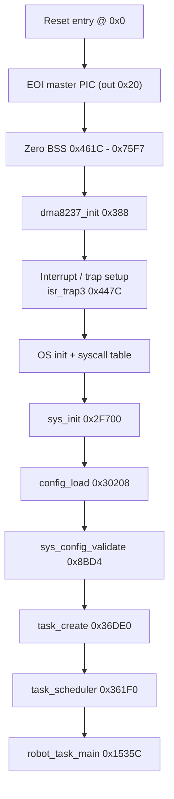
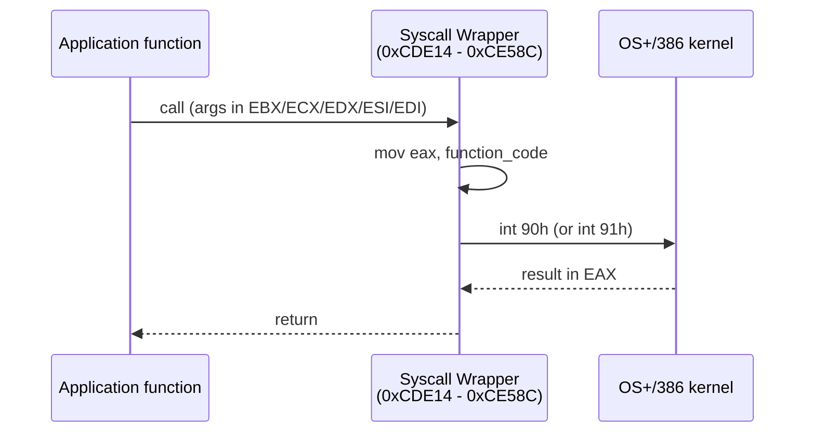
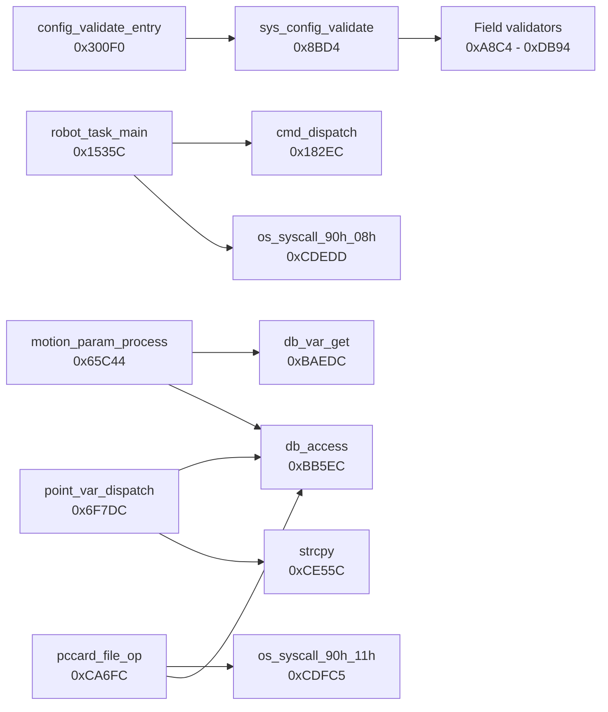

# Sony SRX-611 CPU Board Firmware — Architecture Report

**Image:** `ROM1-C.bin` (1 MB) / IDA database `ROM1-C.bin.i64`
**Target:** Sony SRX-611 SCARA robot controller, CPU board
**Analysis:** static reverse engineering (IDA Professional 9.0, IDAPython)

---

## 1. Executive summary

`ROM1-C.bin` is the main firmware of a **Sony SRX-611 SCARA robot controller**. It runs on an **Intel 80486-class CPU in 16-bit real mode** (using 32-bit registers — "big-real"/unreal mode) under Sony's proprietary real-time OS **"OS+/386 V2.0"** (copyright 1993). The image contains **1298 functions** and **646 strings**, and implements a complete robot controller: a robot-language interpreter (**LUNA**), a **PLC** interface, **4-axis servo/motion** control, a **teach pendant (TP)** UI, **PC-card (PCMCIA)** storage, and a diagnostics/error subsystem.

The physical image corresponds to the two 512 KB flash devices `U24` + `U25` (`MT28F400B5`, 1 MB total); `U23` (`M27C256B`, 32 KB) is a separate boot ROM.

```mermaid
flowchart TB
    subgraph APP["Application Layer"]
        LUNA["LUNA Interpreter<br/>robot_task_main 0x1535C"]
        TP["Teach Pendant UI<br/>tp_menu_dispatch 0x12D84"]
        PLC["PLC Engine<br/>plc_scan 0x4F020"]
        MOT["Motion / Servo<br/>motion_param_process 0x65C44"]
        PCARD["PC-Card Manager<br/>pccard_file_op 0xCA6FC"]
        DIAG["Diagnostics / Error History"]
    end
    subgraph DATA["Data Services"]
        DB["Variable / Parameter DB<br/>db_access 0xBB5EC"]
        CFG["Config Validation<br/>sys_config_validate 0x8BD4"]
        FV["Field Validators<br/>0xA8C4 - 0xDB94"]
    end
    subgraph KERNEL["OS+/386 Kernel"]
        TASK["Tasks / Scheduler<br/>task_scheduler 0x361F0"]
        SYSCALL["Syscall ABI<br/>int 90h / int 91h"]
        IO["I/O Port Layer<br/>io_read_data 0x4A4"]
        DMA["8237A DMA<br/>dma8237_init 0x388"]
        ISR["Interrupt Handlers<br/>isr_dispatch 0x468C"]
        FPU["FPU / String Utilities"]
    end
    subgraph HW["Hardware"]
        CPU["Intel 80486 (real mode)"]
        PIC["8259A PIC"]
        IOB["I/O Boards<br/>0xC000 / 0xC800 / 0xCC00 / 0xD000 / 0xD400"]
        SERVO["Servo Amplifiers x4 (AMP)"]
        ROM["Flash U24+U25 (1 MB)"]
    end
    APP --> DATA
    DATA --> KERNEL
    KERNEL --> HW
```

---

## 2. Platform identification

| Item | Value | Evidence |
|---|---|---|
| CPU | Intel 80486 (386-compatible) | IDA processor module `80486r` |
| Execution mode | 16-bit real mode + 32-bit addressing | `mov edi, imm32`, `lgdt fword ptr`, `pusha` |
| FPU | Present (x87) | `fnstcw` / `fistp` / `fldcw` in `fpu_ftoi` |
| RTOS | "OS+/386 V2.0.I" | banner string at `0x5BA`; copyright 1993 at `0x60C` |
| Image size | `0x0 – 0x100000` (1 MB), single CODE segment | IDA segment `seg000` |
| Interrupt hardware | 8259A PICs (master 0x20/0xA0, slave 0xA0/0xA8) | boot code at `0x0` |
| DMA | 8237A (ports 0xC4 / 0xCC / 0xD4) | `dma8237_init` (`0x388`) |
| I/O board ports | 0xC000, 0xCC00, 0xC800, 0xD400, 0xD000 | port table at `0x500` |
| Robot | SCARA, 4 axes XYZR | strings `Y 4 XYZR`, `P-SCA 3 XYZ`, `EARTH 4 XYZR` |

---

## 3. Boot sequence

Boot is a classic PC-style real-mode init: mask/EOI the PIC, clear BSS, program the DMA controller, install interrupt/trap handlers, then bring up the OS and tasks.

---

## 4. OS layer (OS+/386) and syscall mechanism

The kernel occupies roughly `0x0 – 0x8BD4`. Its system-call interface is a **software-trap ABI**: each wrapper loads a function code into `EAX` and executes `int 90h` or `int 91h`. About **38 wrapper functions** in the range `0xCDE14 – 0xCE58C` were identified and named `os_syscall_90h_XXh` / `os_syscall_91h_XXh`.

Key kernel / low-level routines:

| Address | Name | Role |
|---|---|---|
| `0x0` | `reset_entry` | EOI PIC, zero BSS, call init |
| `0x388` | `dma8237_init` | 8237A DMA controller init |
| `0x46C` | `io_read_status` | indexed I/O-port status read |
| `0x4A4` | `io_read_data` | indexed I/O-port data read |
| `0x4C9` | `io_write_data` | indexed I/O-port data write |
| `0x447C` | `isr_trap3` | OS trap vector 3 handler |
| `0x468C` | `isr_dispatch` | interrupt dispatch |
| `0xCDE08` | `int_disable` | critical section enter (save flags + CLI) |
| `0xCDE0C` | `int_restore` | critical section exit (restore flags) |
| `0xCDDD4` | `fpu_ftoi` | FPU float→int with rounding control |
| `0xCE55C` | `strcpy` | string copy (strlen + rep movs) |

---

## 5. Application subsystems

### 5.1 LUNA interpreter (robot task language)
Error strings reveal a full robot-language interpreter: `LUNA Object code`, `LUNA Robot command`, `LUNA Point data`, `LUNA FOR loop`, `LUNA CALL nest`, `LUNA Branch`, `LUNA Interrupt`, `LUNA LN operand`, `LUNA SQRT operand`. The main dispatcher is `robot_task_main` (`0x1535C`, the largest function at ~6.5 KB).

### 5.2 PLC interface
`plc_program_exec` / `plc_program_exec2` (`0x4DFB8` / `0x4D7E8`), `plc_scan` / `plc_scan2` (`0x4F020` / `0x4FC18`), `plc_io_process` (`0x40F88`), `plc_channel_io` (`0x49080`). Implements channel I/O (`CGET`/`CSET`), bit I/O (`BGET`/`BSET`), counters (`CRST`), timers, keep/input/output/special relays.

### 5.3 Servo and motion (4 axes)
- `motion_param_process` (`0x65C44`) — reads motion parameters via the DB layer.
- `point_interp` (`0x786CC`), `point_var_dispatch` (`0x6F7DC`, jump-table dispatch).
- `motion_record_fetch` / `_2` (`0x756C4` / `0x7624C`); `param_record_fetch` series (`0x931D4` / `0x737CC` / `0x74844`).
- Error strings cover servo ON/OFF, torque limit, position error, current/speed, encoder (thermal/backup/power/copy), homing limit, IPM, WDT, main power OV/OL — a dedicated servo-amplifier (AMP) CPU appears reachable via shared memory ("SERVO CPU communication error").

### 5.4 Variable / parameter database
`db_access` (`0xBB5EC`) is the generic accessor (0x1B record header). `db_get_int/real/str`, `db_put_int/real/str`, `db_field_get`, `db_var_get` wrap it. Supports INT/REAL/POINT/STRING variables and INT/REAL arrays, plus `DATI` / `DATR` / `UTP(read from PLC)` — matching the TP variable-menu strings.

### 5.5 Teach pendant (TP) UI
`tp_menu_dispatch` (`0x12D84`), `display_format` (`0xBCDF4`), `cmd_dispatch` / `_2`. Menu strings at `0xD04xx – 0xD1587` enumerate MANAGE / TEACH / POINT / EXEC / MONIT / I-O screens: clock, diagnostics, error history, TPWRITE, point move/copy, PLC forcing, PC-card save/load/format.

### 5.6 PC-card (PCMCIA) storage
`pccard_file_op` (`0xCA6FC`). Handles SAVE/LOAD (to/from PC card), FORMAT, files `.OBJ` (program), `.DAT` (point data), `.COD` (PLC program), keep-relay data, battery status, write-protect.

### 5.7 Configuration validation
`sys_config_validate` (`0x8BD4`), `config_block_validate` (`0x30860`), `point_data_validate` (`0x444E0`), `config_validate_entry` / `config_load`. These drive a large set of field-validator subroutines (region `0xA8C4 – 0xDB94`) checking robot kind/axes, reduction ratio, RV limits, payload, safety specs (RIA/VDE), etc.

*(Edges above are verified direct call relationships from the disassembly.)*

---

## 6. Memory map (approximate)

| Range | Contents |
|---|---|
| `0x00000 – 0x008BD4` | Boot + OS+/386 kernel + I/O + DMA + ISRs |
| `0x008BD4 – 0x00A16E` | `sys_config_validate` |
| `0x00A8C4 – 0x00DB94` | Field validators + variable DB accessor library |
| `0x00CDD4 – 0x00CE600` | OS syscall wrappers + utility leaves |
| `0x012D84 – 0x01B900` | TP menu / command dispatch / application init |
| `0x02F700 – 0x0031xxx` | System init / config load |
| `0x03xxxx – 0x05xxxx` | PLC engine + field dispatch |
| `0x06xxxx – 0x08xxxx` | Motion / point processing |
| `0x0C0000 – 0x0D8000` | TP UI handlers + string tables (menus `0xD04xx–0xD1587`, errors `0xD2F25–0xD99A5`) |
| `0x0E0000 – 0x100000` | Data / tables (0xFF padding near top, `0xFFF00+`) |

```mermaid
flowchart TD
    subgraph M["ROM1-C.bin — 1 MB linear image (0x0 - 0x100000)"]
        R1["0x00000-0x008BD4<br/>Boot + OS kernel + I/O + DMA + ISR"]
        R2["0x008BD4-0x00A16E<br/>sys_config_validate"]
        R3["0x00A8C4-0x00DB94<br/>Field validators + DB accessors"]
        R4["0x00CDD4-0x00CE600<br/>OS syscall wrappers / utilities"]
        R5["0x012D84-0x01B900<br/>TP menu / command dispatch / app init"]
        R6["0x02F700-0x0051xxx<br/>System init + PLC + field dispatch"]
        R7["0x006xxxx-0x008xxxx<br/>Motion / point processing"]
        R8["0x0C0000-0x0D8000<br/>TP UI handlers + string tables"]
        R9["0x0E0000-0x100000<br/>Data / tables / 0xFF padding"]
    end
    R1 --> R2 --> R3 --> R4 --> R5 --> R6 --> R7 --> R8 --> R9
```

---

## 7. Annotation summary

**91 functions renamed and commented** (0 failures), covering:

| Group | Count | Examples |
|---|---|---|
| Boot / kernel / I/O | ~10 | `reset_entry`, `dma8237_init`, `io_read_data` |
| OS syscall wrappers | ~38 | `os_syscall_90h_XXh`, `os_syscall_91h_XXh` |
| Utility / FPU / string | ~5 | `fpu_ftoi`, `strcpy`, `int_disable` |
| Variable DB layer | ~14 | `db_access`, `db_get_int`, `db_var_get` |
| Application (major) | ~30 | `robot_task_main`, `tp_menu_dispatch`, `plc_*`, `motion_*`, `point_*`, `pccard_file_op` |

The top ~26 of the 30 largest functions are named — well over half of the "major" functions by size/importance.

---

## 8. Key reference table

| Address | Name | Size |
|---|---|---|
| `0x0` | `reset_entry` | — |
| `0x388` | `dma8237_init` | 0xE2 |
| `0x46C` / `0x4A4` / `0x4C9` | `io_read_status` / `io_read_data` / `io_write_data` | — |
| `0x8BD4` | `sys_config_validate` | 0x159A |
| `0x1535C` | `robot_task_main` | 0x1995 |
| `0x12D84` | `tp_menu_dispatch` | 0x955 |
| `0x4DFB8` | `plc_program_exec` | 0xB7B |
| `0x4F020` | `plc_scan` | 0xBF7 |
| `0x65C44` | `motion_param_process` | 0x10DB |
| `0x6F7DC` | `point_var_dispatch` | 0x116B |
| `0xBB5EC` | `db_access` | 0x147 |
| `0xCA6FC` | `pccard_file_op` | 0xEC0 |
| `0xCDE14…` | `os_syscall` wrappers (int 90h/91h) | — |

---

## 9. Notes and limitations

- The IDA database was originally unpacked (`.i64` + `.id0/.id1/.nam/.til`); batch operation repacked it into a single self-contained `ROM1-C.bin.i64`. A backup of the pre-annotation `.i64` is at `C:\Users\radiolok\AppData\Local\Temp\kilo\ROM1-C.bin.i64.bak`.
- String cross-references are not auto-resolved by IDA (real-mode segment/offset addressing), so per-function string attribution was based on call-graph and context rather than direct xrefs. Function names are best-effort; OS syscall function codes are exact, and subsystem-level names (PLC / motion / DB / TP / PC-card) are high-confidence.
- Fully resolving the ~38 OS syscall semantics (e.g. `task_create`, `sem_signal`) would require OS+/386 system-call documentation or deeper Hex-Rays decompilation.
