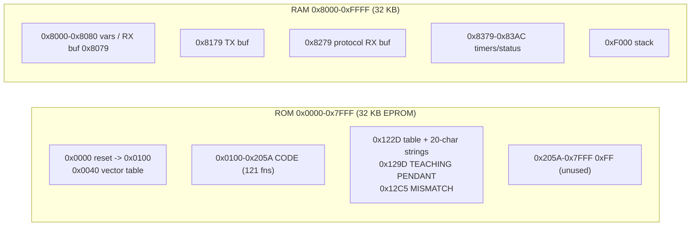

# Sony SRX-611 Teach-Pendant Firmware — Internal Structure Report

**Firmware:** `IC6_M27C256B@DIP28.BIN` (32 KB, socket **IC6**, EPROM M27C256B)
**IDA DB:** `IC6_M27C256B@DIP28.BIN.i64`
**Location:** `D:\radiolok@oc.urlnn.ru\Datasheets\SONY SRX\FW\TP\`
**Analysis:** IDA Professional 9.0, processor module `64180`

---

## 1. Executive summary

The teach pendant (TP) is built around a **Hitachi HD64180** CPU (Z180-family,
Z80-compatible). It is deliberately a **thin terminal**: it scans its keypad, drives a
20-character display, and runs a small **command interpreter** driven by messages from
the CPU board over an **ASCI serial link**. It contains **no robot logic and no error
text** — all menus and error strings (`E nnn`) are produced by the main CPU board
(`ROM1-C.bin`).

The firmware occupies only **~8 KB** of the 32 KB EPROM (`0x0000-0x205A`); the rest is
`0xFF`. IDA recovered **121 functions**. Its most interesting native strings are the
boot banner `TEACHING PENDANT` and the mismatch banner `MISMATCH`, plus a small
**host-identity handshake** (`"SRX6"` from the controller ↔ `"TP4"` from the pendant).

---

## 2. Platform & memory map

| Item | Value |
|---|---|
| CPU | Hitachi **HD64180** (Z180 family, Z80 instruction set), IDA proc `64180` |
| ROM | `0x0000 – 0x7FFF` (32 KB M27C256B); **used: `0x0000 – 0x205A`**, remainder `0xFF` |
| RAM | `0x8000 – 0xFFFF` (32 KB) |
| Reset | vector at `0x0000` → `jp 0x0100` |
| Stack | top at `0xF000` (`ld ix,0F000h; ld sp,ix`) |
| Interrupts | `IM 2` (Z80 vector mode), `I = 0` |
| BSS/var area | `0x8000 – 0x8400` (RAM) |
| Code size | 121 functions, `0x0100 – 0x205A` (~8 KB) |



---

## 3. Boot sequence

```
0x0000  jp 0x0100
0x0100  di
0x0101  ld ix,0F000h ; ld sp,ix      ; stack
0x0107  ld a,0 ; ld i,a              ; interrupt vector base = 0
0x010B  call sub_12B                 ; peripheral init (see §6)
0x010E  call sub_147                 ; display/keyboard init
0x0111  call sub_14E                 ; RAM variable init
0x0114  in0 a,(4) ; and 4            ; wait for hardware-ready bit
0x0119  jp nz,0x0114
0x011C  ei
0x011D  ld a,0 ; ld (8392h),a        ; clear status/error latch
0x0122  call sub_1EA                 ; periodic housekeeping
0x0125  call sub_25C                 ; command dispatcher
0x0128  jp 0x011D                    ; main super-loop
```

The main loop is a classic **super-loop**, not an RTOS: housekeeping, then one command
dispatch, forever. Interrupts provide timing/serial service.

---

## 4. Interrupt system

- `IM 2` with `I=0` → vector table based at `0x0000`.
- A table of 16-bit handler addresses sits at **`0x0040`**:

| Vector slot | Target | Meaning |
|---|---|---|
| `0x0040` | `0x0000` | (unused) |
| `0x0042` | `0x0000` | (unused) |
| `0x0044` | `0x06FA` | **ISR A** |
| `0x0046`,`0x0048`,`0x004A`,`0x004C` | `0x06F7` | stub (`EI; RETI`) |
| `0x004E` | `0x07A6` | **ISR B** |
| `0x0050` | `0x06F7` | stub |

- **ISR A (`0x06FA`)** — saves regs, `in0 a,(10h)`, `in0 a,(0Ch)`, then decrements/moves
  a set of counters at `0x8379/0x837A/0x837D/0x837E/0x837F/0x8380/0x8381/0x8382/0x8383`
  and flags `0x8076/0x8077/0x8392`; calls `sub_8CB`. → **periodic timer tick**
  (software timers / debounce / blink).
- **ISR B (`0x07A6`)** — `in0 a,(08h)`→`0x8078`, tests `in0 (04h)&4`, then services
  `0x8076/0x8077/0x8381/0x8382/0x8383/0x837E`; calls `sub_812`, `sub_85B`, `sub_882`,
  `sub_89C`. → **serial / hardware-data handler**.
- Neither ISR contains any string or error logic.

---

## 5. Main command dispatcher (`sub_25C` @ `0x025C`)

This is the heart of the pendant. It reads one **command byte** from the protocol
receive buffer at **RAM `0x827B`** and dispatches through a long `cp`-chain to a handler:

```c
cmd = *(byte*)0x827B;              // ix = 0x8279, (ix+2)
switch (cmd) {
  case 0x01: sub_12ED(); break;    // handshake / version check
  case 0x10: sub_1346(); break;    // key-repeat group
  case 0x11: sub_1350(); break;
  case 0x20..0x23: sub_1553/159B/15B6/15D1();  break;
  case 0x30..0x34: sub_15EC/1649/16D3/175D/17C0(); break;
  case 0x40..0x43: sub_1821/1856/18A7/18FA(); break;
  case 0x50,0x53,0x55,0x5A..0x5D: sub_19BF/1A0D/1A5F/1AB6/1AE3/1B09/1B4F(); break;
  case 0x60,0x63,0x65: sub_1BBC/1C18/1C78(); break;
  case 0x70,0x71,0x72,0x78,0x79,0x7A: nullsub_1..4 / sub_1D0C / sub_1D9B(); break;
  case 0x80,0x81,0x8F: sub_1DE8/1E4E/1ECF(); break;
  case 0x90..0x93: sub_1ED6/1F1B/1F75/1FB6(); break;
  case 0xA0,0xA1: sub_1FFE/2028(); break;
  case 0xB0..0xC A: nullsub_5..18();   break;   // not implemented
  default:      sub_5FD();  break;              // unknown -> error
}
```

- Offsets `0x10/0x20/0x30/0x40/0x50/0x60/0x70/0x80/0x90/0xA0` behave as **command
  classes**; the low nibble selects the function.
- `nullsub_1..18` (`0x1D08-0x1D0C`, `0x204C-0x2059`) are **1-byte `RET` stubs** for
  commands the TP accepts but does not implement.
- **`sub_5FD` (unknown / bad command)** clears the receive command, sets status latch
  `0x8392 = 0x0D`, and calls `sub_BFD` (error indication), then clears the latch.

---

## 6. Host protocol & the "SRX6" / "TP4" handshake

**Command `0x01` → `sub_12ED` @ `0x12ED`** is a startup identity check:

```c
ix = 0x8279;                       // protocol RX buffer
if ( *(ix+1)==7 &&                 // length == 7
     *(ix+3)=='S' && *(ix+4)=='R' && *(ix+5)=='X' && *(ix+6)=='6' )
     status = 0;                   // OK
else status = 8;                   // MISMATCH
*(0x8392) = status;                // status/error latch

// build reply in TX buffer at 0x8179:
buf[0]=0x1B; buf[1]=7; buf[2]=0x01; buf[3]=status;
buf[4]='T'; buf[5]='P'; buf[6]='4';     // "TP4"
sub_A4C();                          // send
```

So the **controller declares itself as `"SRX6"`** (SRX-611 generation) and the
**pendant answers `"TP4"`**, echoing a status byte (`0` OK / `8` mismatch). On a
mismatch the main loop detects `0x8392 == 8` (`sub_1EA`) and shows the **`MISMATCH`**
banner. This is the TP's firmware/type guard.

Protocol message frames (7 bytes) use a lead byte `0x1B`, a length byte, a command byte,
then payload — matching the `"SRX6"` request layout in the RX buffer at `0x8279`.

Other buffers:
- **RX buffer** `0x8279…` (length at `+1` = `0x827A`, command at `+2` = `0x827B`).
- **Secondary RX** `0x8079…` (used by `sub_1EA` → `sub_B75`).
- **TX buffer** `0x8179…`.

---

## 7. Display & keyboard

- **Display is 20 characters wide.** Two literal banner rows exist:
  - `0x129D`: `"  TEACHING   PENDANT"`
  - `0x12C5`: `"      MISMATCH     "`
  - `0x12B1` / `0x12D9`: 20-space filler rows (blank lines).
- A small **segment/pattern table** precedes them at `0x122D` (`"1111111111"`, then
  digit/bit patterns); the table at `0x122D` is referenced from `0x124A`.
- Display strings are addressed by **computed pointers**, so IDA shows **no xrefs**
  (same effect seen in the CPU firmware).
- **Key repeat / modifier logic** is `sub_135A` @ `0x135A`: it samples direction/modifier
  key states (`0x8011…0x8014` bits `0x10/0x20/0x40/0x80`) and writes an auto-repeat
  period into `0x8073` (values `0x32/0x64/0x96/0xC8` = 50/100/150/200), i.e. faster
  repeat when more keys are held.
- Key/debounce variables live at `0x8073-0x8078`; `0x8078` is loaded from `in0(08h)`
  in ISR B.

---

## 8. I/O port map

### 8.1 HD64180 internal I/O (`in0`/`out0`, I/O `0x00-0x3F`)

| Port(s) | Use (observed init) |
|---|---|
| `0x00-0x05` | DMA / system regs (`out0 0x00=0x65, 0x01=5, 0x02=7, 0x04=8, 0x05=0`) |
| `0x0A` | `out0 0x0A = 0` |
| `0x0C-0x0F` | ASCI baud/time constants (`ld bc,0FA0h` → `0x0C/0x0D/0x0E/0x0F`) |
| `0x10` | **ASCI serial channel** (`out0 0x10=0x10`, then `=0x11` enable) |
| `0x30-0x34` | PRT/timer regs (`0x30=2, 0x31=0xC1, 0x32=0xF0, 0x33=0x5F, 0x34=0x38`) |
| `0x36` | `out0 0x36 = 0x7C` |
| `0x38-0x3A` | `out0 = 0` |
| `0x3F` | `out0 0x3F = 0x1F` (system/IO control) |
| `0x04`,`0x08`,`0x0C` | read in ISRs / init |

### 8.2 External I/O (`in0`/`out0` ≥ `0x40`)

| Port(s) | Reads | Writes | Likely role |
|---|---|---|---|
| `0x80-0x83` | 2/2/3 | 4/0/10/1 | **display / keyboard controller** data+command |
| `0xC0-0xC1` | 1 | 16/7 | **display/device strobe + reset sequence** (init writes `0x38,0x38,0x08,0x01,0x06,0x00` with delays via `sub_AB6`) |

The addresses are used with the HD64180 `in0`/`out0` (`ED 38/ED 39`) extended I/O forms.

---

## 9. Key functions (annotated by address)

| Addr | Name | Role |
|---|---|---|
| `0x0000` | reset | `jp 0x0100` |
| `0x0040` | vector table | HD64180/Z80 IM2 vectors |
| `0x0100` | `_start` | reset/init/main loop |
| `0x012B` | `sub_12B` | peripheral init (calls `sub_610…sub_677`) |
| `0x0147` | `sub_147` | display/keyboard init (`sub_695`,`sub_6AD`) |
| `0x014E` | `sub_14E` | RAM variable init |
| `0x01EA` | `sub_1EA` | periodic housekeeping + status/mismatch handling |
| `0x025C` | `sub_25C` | **command dispatcher** |
| `0x05FD` | `sub_5FD` | unknown-command / error indication |
| `0x0610…0x06AD` | `sub_610…sub_6AD` | HD64180 register + ASCI + ext-device init |
| `0x06FA` | ISR A | timer tick |
| `0x06F7` | stub | `EI; RETI` |
| `0x07A6` | ISR B | serial/hardware service |
| `0x0A43/0x0A4C/0x0AB6` | `sub_A43/A4C/AB6` | external-I/O byte send + delay helpers |
| `0x0B1C…0x0D4C` | `sub_B1C…sub_D4C` | display / message formatting & output |
| `0x116F` | `sub_116F` | display/key handler (large leaf cluster) |
| `0x12ED` | `sub_12ED` | **handshake / “SRX6”↔“TP4” check** |
| `0x1346/0x1350` | `sub_1346/1350` | command 0x10/0x11 handlers |
| `0x135A` | `sub_135A` | key auto-repeat rate selection |
| `0x1D08-0x1D0C`, `0x204C-0x2059` | `nullsub_*` | unimplemented command stubs (`RET`) |

---

## 10. Relation to the CPU board (why the TP has no error text)

- The TP firmware contains **no `error`, `safety`, `switch`, or `E nnn` strings** — verified
  by full-ROM ASCII/Shift-JIS scan.
- The TP only has **20-character display rows** and a serial command interpreter.
- Therefore the CPU board (`ROM1-C.bin`) **formats all error/menu text and sends it as
  display commands** (the `0x10/0x20/0x30…` command classes in `sub_25C`), while the TP
  merely renders characters and returns key events.
- This matches the finding in `SRX-611_error_401_DSS_report.md`: `E 401 DSS off error` is
  generated and text-formatted entirely on the CPU board.

---

## 11. Repro / tooling notes

- IDA batch:
  ```
  & "C:\Program Files\IDA Professional 9.0\idat.exe" -A -L"<log.txt>" -S"<script.py>" "<...>\TP\IC6_M27C256B@DIP28.BIN.i64"
  ```
- The `.i64` was auto-upgraded from DB format 770 → 900 on first open by IDA 9.
- The vector table and several ISRs are **not auto-recognised as code** by IDA (they
  appear as `db`); disassemble `0x06FA` / `0x07A6` manually with `idc.create_insn` or by
  reading bytes.
- Strings have **no xrefs** (computed pointers), as in the CPU firmware.
